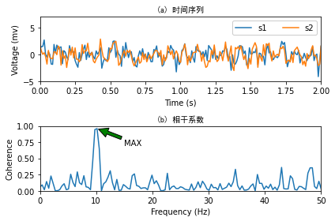
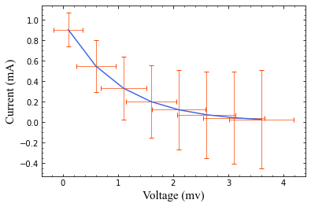
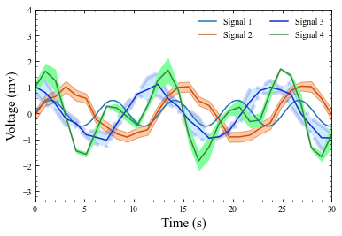
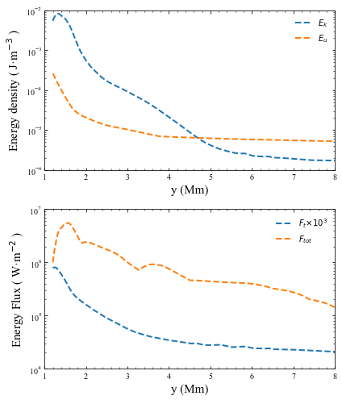

# 实验一：数据可视化

摘要：本次实验主要是为了练习线条图的基本控制手段，掌握图形的绘制与美化过程和学会绘制科学图形。

关键词：数据可视化；分图绘制；图片美化

## 1. 图形的基本元素和构成

图形的基本元素：原点、变量（单位）、数据、符号、图注。

图形的构成：结构、标题、轴标题主刻度、刻度值、分刻度、分刻度值、散点图、线图、图例、网格。

## 2. 分图绘制的基本原理

使用subplot(nrow, ncols, index) 

nrow,ncols表示分图一共几行几列；index表示要把图片放到哪个位置。

## 3. 实验结果


```python
###任务一###

import numpy as np
import matplotlib.pyplot as plt

np.random.seed(19680801)

dt = 0.01 # time step
t = np.arange(0, 30, dt)
nse1 = np.random.randn(len(t))     # 白噪音
nse2 = np.random.randn(len(t))     # 白噪音
# Two signals with a coherent part at 10Hz and a random part
s1 = np.sin(2 * np.pi * 10 * t) + nse1 
s2 = np.sin(2 * np.pi * 10 * t) + nse2
# 绘制分图
fig, axs = plt.subplots(2, 1)
axs[0].plot(t, s1, t, s2)
cxy, f = axs[1].cohere(s1, s2, 256,1. / dt)

###修改和添加内容###

# 1. 给横轴与纵轴添加单位，可以自己设计，但需符合基本科学逻辑。
axs[0].set_xlabel('Time (s)')
axs[0].set_ylabel('Voltage (mv)') 
axs[1].set_xlabel('Frequency (Hz)')
axs[1].set_ylabel('Coherence')

# 2. 将上图与下图分布标记 “(a) 时间序列” “（b）相干系数”。
axs[0].set_title('(a) 时间序列',fontproperties='SimHei') #黑体 
axs[1].set_title('(b) 相干系数',fontproperties='SimHei')

# 3. 图（a）添加图例(Legend)，标记不同颜色的信号s1与s2。
axs[0].legend(['s1','s2'],ncol= 2,framealpha=1) 
# eps格式不支持透明度，所以这里将图例透明度设为1(不透明)

# 4. 图（b）添加(annotation),指出峰值位置。 提示：annotate。
axs[1].annotate('MAX',xy=(f[np.argmax(cxy)],max(cxy)),xytext=(15,0.7),
            arrowprops=dict(facecolor='green',shrink=0.05))

# 5. 调整图(a)和(b)的绘图范围，字体，颜色、刻度等等元素，让图面符合1-3-6美学原则，即空白或背景面积60%，数据所占面积30%，标注刻度等元素占比10%。
axs[0].grid(False)
axs[1].grid(False)
axs[0].set_xlim(0, 2)
axs[0].set_ylim(-5, 7)
axs[1].set_ylim(0,1)
axs[1].set_xlim(0,50)
#axs[0].set_xticks([0,0.5,1,1.5,2])
fig.tight_layout()

# 7. 保存为eps和jpeg两种格式。
plt.savefig('task1.eps',dpi=300)
plt.savefig('task1.jpeg',dpi=300)

plt.show() 
#######
```


    

    


```python
###任务二（图一）###

import numpy as np
import matplotlib.pyplot as plt

#example data
x = np.arange(0.1, 4, 0.5)
y = np.exp(-x)

# example variable error bar values
yerr1 = 0.1 + 0.2*np.sqrt(x)
xerr1 = 0.1 + yerr1

# First illustrate basic pyplot interface, using defaults where possible.
plt.figure()

##修改如下（美化图片）
plt.errorbar(x, y, xerr=xerr1, yerr=yerr1,color='royalblue',
             ecolor='orangered',elinewidth=0.7,capsize=3)
plt.xlabel('Voltage (mv)',family='Times New Roman',size=15)
plt.ylabel('Current (mA)',family='Times New Roman',size=15)
plt.minorticks_on()
plt.tick_params(which='both',direction='in',top=True,right=True)


plt.show()
```


    

    


```python
###任务二（图二）###

import numpy as np
from matplotlib import pyplot as pl

x = np.linspace(0, 30, 100)
y = np.sin(x) * 0.5
pl.plot(x, y)

x = np.linspace(0, 30, 30)
y = np.sin(x/6*np.pi)
error = np.random.normal(0.1, 0.02, size=y.shape) +.1
y += np.random.normal(0, 0.1, size=y.shape)

# 颜色用RGB十六进制代码；可在线查询
pl.plot(x, y, color='#CC4F1B')
pl.fill_between(x, y-error, y+error,
    alpha=0.5, edgecolor='#CC4F1B', facecolor='#FF9848')

y = np.cos(x/6*np.pi)    
error = np.random.rand(len(y)) * 0.5
y += np.random.normal(0, 0.1, size=y.shape)
pl.plot(x, y, color='#1B2ACC')
pl.fill_between(x, y-error, y+error,
    alpha=0.2, edgecolor='#1B2ACC', facecolor='#089FFF',
    linewidth=4, linestyle='dashdot', antialiased=True)

y = np.cos(x/6*np.pi)  + np.sin(x/3*np.pi)  
error = np.random.rand(len(y)) * 0.5
y += np.random.normal(0, 0.1, size=y.shape)
pl.plot(x, y, color='#3F7F4C')

pl.fill_between(x, y-error, y+error,
    alpha=1, edgecolor='#3F7F4C', facecolor='#7EFF99',
    linewidth=0)

##美化

#添加轴标题（单位）,设置字体和大小
pl.xlabel('Time (s)',family='Times New Roman',size=15)
pl.ylabel('Voltage (mv)',family='Times New Roman',size=15)
#显示分刻度，刻度朝内，四周都显示刻度
plt.minorticks_on()
plt.tick_params(which='both',direction='in',top=True,right=True)
plt.rcParams['font.sans-serif'] = ['Times New Roman']

#绘图范围
pl.xlim(0,30)
pl.ylim(-3.4,4)
#添加图例
pl.legend(['Signal 1','Signal 2','Signal 3','Signal 4'],ncol=2,frameon=False)

fig.tight_layout()
pl.show()
```


    

    


```python
###任务三###

import numpy as np
import matplotlib.pyplot as plt

data   = np.genfromtxt("data.dat",dtype='f8')
height = data[:,0]
Vx     = data[:,1]
Ke     = data[:,2]
IE     = data[:,3]
Tz     = data[:,4]
Fz     = data[:,5]

#plt.figure()
#plt.plot(height,Vx,linewidth=2)
#plt.xlabel('y (Mm)')
#plt.ylabel('Vx$_{i}$ [km$^{-2}$]')
#plt.show()

#合并分图
fig,axs = plt.subplots (2,1,figsize=(6,7) )

#分图一
plt.subplot(211)

plt.plot(height,Ke,height,IE,linewidth=2,linestyle='--')
plt.yscale('log')
plt.xlabel('y (Mm)',family='Times New Roman',size=15)
plt.ylabel('Energy density ( J·m$^{-3}$ )',family='Times New Roman',size=15)
#修改图片
plt.legend(['${E_k}$','${E_u}$'],frameon=False,)
plt.ylim(10**-6,10**-2)
plt.xlim(1,8)
plt.minorticks_on()
plt.tick_params(which='both',direction='in')
plt.minorticks_on()
plt.tick_params(which='both',direction='in',top=True,right=True)

#分图二
plt.subplot(2,1,2)
plt.plot(height,Tz*1000.0,height,Fz,linewidth=2,linestyle='--')
plt.yscale('log')
plt.xlabel('y (Mm)',family='Times New Roman',size=15)
plt.ylabel('Energy Flux ( W·m$^{-2}$ )',family='Times New Roman',size=15)
#修改图片
plt.legend(['${F_t×10^3}$','${F_{tot}}$'],frameon=False)
plt.ylim(10**4,10**7)
plt.xlim(1,8)
plt.minorticks_on()
plt.tick_params(which='both',direction='in',top=True,right=True)
#调整子图间距
fig.tight_layout()

plt.show()
```


    

    


## 4. 结论

初步学习了如何用python实现数据可视化。学会了matplotlib中添加和修改图例，标题，字体，颜色，大小，刻度等。学会了将多个图片合并为分图的形式。

## 5. 参考文献

https://matplotlib.org/stable/index.html

https://pypi.org/project/SciencePlots/

https://zhuanlan.zhihu.com/p/109245779
