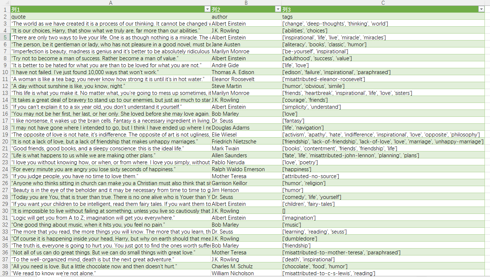
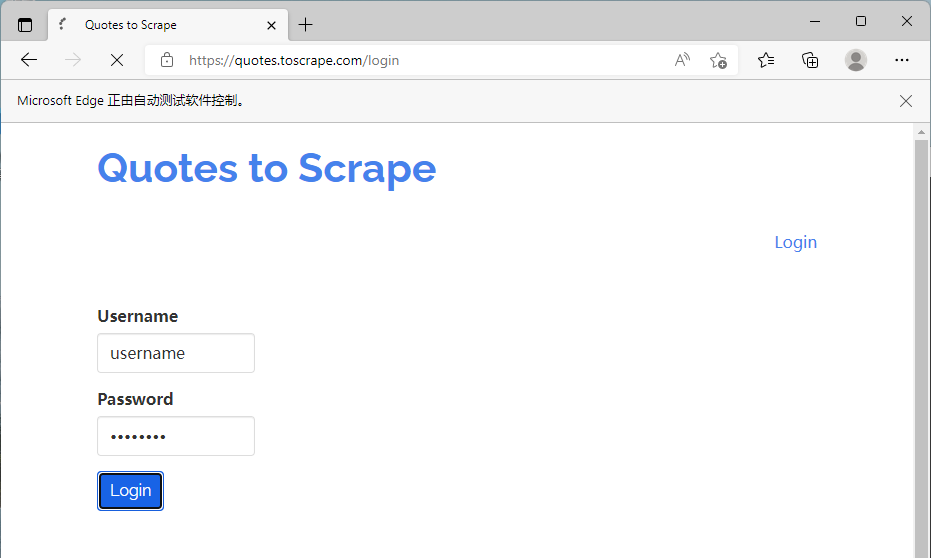
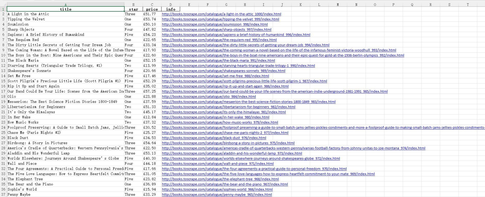
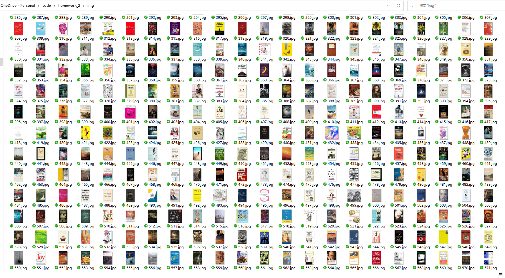

# 实验二：爬虫技术

## 摘要

本次实验介绍了互联网访问的基本原理，网页的基本结构和类型，网络爬虫的基本原理。并通过三个小实例实现对文本的爬取，对图片的爬取和网页会员自动登录。

## 关键词

网页编程，爬虫，自动登录，HTML

## 1. 介绍网页编程的基本原理

网络编程从大的方面说就是对信息的发送到接收，中间传输为物理线路的作用。网络编程最主要的工作就是在发送端把信息通过规定好的协议进行组装包，在接收端按照规定好的协议把包进行解析，从而提取出对应的信息，达到通信的目的。中间最主要的就是数据包的组装，数据包的过滤，数据包的捕获，数据包的分析，当然最后再做一些处理，代码、开发工具、数据库、服务器架设和网页设计这5部分你都要接触。

代码分类：

静态代码是服务器不解析直接发送给客户端的部分，用做布局效果，一般不用于数据库操作静态代码分html，javascript，css等，其中html语言是基础，要学网络编程就先学html语言.javascript用于实现某些特效，css是样式语言.这3个语言组合起来，可以设计出美妙的网页效果。

动态代码是服务器需要解析的部分，用作数据库连接操作等.有php，jsp，asp这几种

汇编语言

汇编语言的实质和机器语言是相同的，都是直接对硬件操作，只不过指令采用了英文缩写的标识符，更容易识别和记忆。它同样需要编程者将每一步具体的操作用命令的形式写出来。
汇编程序通常由三部分组成：指令、伪指令和宏指令。汇编程序的每一句指令只能对应实际操作过程中的一个很细微的动作，例如移动、自增，因此汇编源程序一般比较冗长、复杂、容易出错，而且使用汇编语言编程需要有更多的计算机专业知识，但汇编语言的优点也是显而易见的，用汇编语言所能完成的操作不是一般高级语言所能实现的，而且源程序经汇编生成的可执行文件不仅比较小，而且执行速度很快。

高级语言

高级语言主要是相对汇编语言而言，它并不是特指某一种具体的语言，而是包括了很多编程语言，这些语言的语法、命令格式都各不相同。高级语言所编制的程序不能直接被计算机识别，必须经过转换才能被执行，按转换方式可将它们分为两类:

解释类：执行方式类似于我们日常生活中的“同声翻译”，应用程序源代码一边由相应语言的解释器“翻译”成目标代码(机器语言)，一边执行，因此效率比较低，而且不能生成可独立执行的可执行文件，应用程序不能脱离其解释器，但这种方式比较灵活，可以动态地调整、修改应用程序。

编译类：编译是指在应用源程序执行之前，就将程序源代码“翻译”成目标代码(机器语言)，因此其目标程序可以脱离其语言环境独立执行，使用比较方便、效率较高。但应用程序一旦需要修改，必须先修改源代码，再重新编译生成新的目标文件(* .OBJ)才能执行，只有目标文件而没有源代码，修改很不方便。大多数的编程语言都是编译型的，例如Visual C++、Visual Foxpro、Delphi等。

语言种类  
网络编程语言主要包括PHP、ASP、NET、JSP。

1、PHP  
PHP 即Hypertext Preprocessor(超文本预处理器)，它是当今Internet上最为火热的脚本语言，其语法借鉴了C、Java、PERL等语言，但只需要很少的编程知识你就能使用PHP建立一个真正交互的Web站点。它与HTML语言具有非常好的兼容性，使用者可以直接在脚本代码中加入HTML标签，或者在HTML标签中加入脚本代码从而更好地实现页面控制。PHP提供了标准的数据库接口，数据库连接方便，兼容性强；扩展性强；可以进行面向对象编程。

2、ASP  
ASP 即Active Server Pages，它是微软开发的一种类似HTML(超文本标识语言)、Script(脚本)与CGI(公用网关接口)的结合体，它没有提供自己专门的编程语言，而是允许用户使用许多已有的脚本语言编写ASP的应用程序。ASP的程序编制比HTML更方便且更有灵活性。它是在Web服务器端运行，运行后再将运行结果以HTML格式传送至客户端的浏览器。ASP程序语言最大的不足就是安全性不够好。 　ASP的最大好处是可以包含HTML标签，也可以直接存取数据库及使用无限扩充的ActiveX控件，因此在程序编制上要比HTML方便而且更富有灵活性。通过使用ASP的组件和对象技术，用户可以直接使用ActiveX控件，调用对象方法和属性，以简单的方式实现强大的交互功能。但ASP技术也非完美无缺，由于它基本上是局限于微软的操作系统平台之上，主要工作环境是微软的IIS应用程序结构，又因ActiveX对象具有平台特性，所以ASP技术不能很容易地实现在跨平台Web服务器上工作。

3、JSP  
JSP即Java Server Pages，它是由Sun Microsystem公司于1999年6月推出的新技术，是基于Java Servlet以及整个Java体系的Web开发技术。JSP和ASP在技术方面有许多相似之处，不过两者来源于不同的技术规范组织，以至 ASP一般只应用于Windows NT/2000平台，而JSP则可以在85%以上的服务器上运行，而且基于JSP技术的应用程序比基于ASP的应用程序易于维护和管理，所以被许多人认为是未来最有发展前途的动态网站技术。

4、.NET  
NET是ASP的升级版，也是由微软开发，但是和ASP却有天壤之别。NET的版本有1.1、2.0、3.0、3.5、4.0。是网站动态编程语言里最好用的语言，不过易学难精。NET2.0开始，NET把前台代码和后台程序分为两个文件管理，使得NET表现和逻辑相分离。NET网站开发跟软件开发差不多。NET的网站是编译执行的，效率比ASP高很多。NET在功能性、安全性和面向对象方面都做的非常优秀，是非常不错的网站编程语言。

网络模型  
网络模型：描述网络的结构原理和工作原理  
OSI参考模型：七层  
Internet网络模型：四层  
网络协议：指定层上进行数据交换的规则。  
Internet的网络层协议：IP协议；DNS协议(辅助协议)  
Internet的传输层协议：TCP协议；UDP协议。  

套接字  
套接字(Sockets)：应用程序和网络协议的接口。  
Java Sockets：Java应用程序和网络协议的接口，提供若干个类的定义。  
Java应用程序利用这些类继承网络协议的行为，实现网络通信。  
TCP Sockets：使用TCP协议实现可靠的网络通信。  
UDP Sockets：使用UDP协议实现效率较高的网络通信。

数据包  
数据包是网络通信编程的一个重要概念，也称为组装包，指在应用层数据或报文按照一定事先规定好的规则整合的数据集合，实际操作包括组包(打包)，数据包传送，解包。 组包(打包)，指按照协议把零散的数据或报文按照组合起来，实际应用中，比如在C++编程中，往往定义一种新的数据类型用来存储数据包的结构。数据包传送，指数据包的电气物理传输。解包，指接收端对接收的数据进行解析，获得有用信息和数据。数据包经常通过套接字来传送．

## 2. 介绍网络访问过程

1. 浏览器进行 DNS 域名解析，得到对应的 IP 地址
2. 根据这个 IP，找到对应的服务器建立连接（三次握手）
3. 建立 TCP 连接后发起 HTTP 请求（一个完整的 http 请求报文）
4. 服务器响应 HTTP 请求，浏览器得到 html 代码（服务器如何响应）
5. 浏览器解析 html 代码，并请求 html 代码中的资源（如js、css、图片等）
6. 浏览器对页面进行渲染呈现给用户
7. 服务器关闭 TCP 连接（四次挥手）

1、输入地址

当我们开始在浏览器中输入网址的时候，浏览器其实就已经在智能的匹配可能得 url 了，他会从历史记录，书签等地方，找到已经输入的字符串可能对应的 url，然后给出智能提示，让你可以补全url地址。对于 google的chrome 的浏览器，他甚至会直接从缓存中把网页展示出来，就是说，你还没有按下 enter，页面就出来了。

2、浏览器查找域名的 IP 地址　　

1) 请求一旦发起，浏览器首先要做的事情就是解析这个域名，一般来说，浏览器会首先查看本地硬盘的 hosts 文件，看看其中有没有和这个域名对应的规则，如果有的话就直接使用 hosts 文件里面的 ip 地址。

2) 如果在本地的 hosts 文件没有能够找到对应的 ip 地址，浏览器会发出一个 DNS请求到本地DNS服务器 。本地DNS服务器一般都是你的网络接入服务器商提供，比如中国电信，中国移动。

3) 查询你输入的网址的DNS请求到达本地DNS服务器之后，本地DNS服务器会首先查询它的缓存记录，如果缓存中有此条记录，就可以直接返回结果，此过程是递归的方式进行查询。如果没有，本地DNS服务器还要向DNS根服务器进行查询。

4) 根DNS服务器没有记录具体的域名和IP地址的对应关系，而是告诉本地DNS服务器，你可以到域服务器上去继续查询，并给出域服务器的地址。这种过程是迭代的过程。

5) 本地DNS服务器继续向域服务器发出请求，在这个例子中，请求的对象是.com域服务器。.com域服务器收到请求之后，也不会直接返回域名和IP地址的对应关系，而是告诉本地DNS服务器，你的域名的解析服务器的地址。

6) 最后，本地DNS服务器向域名的解析服务器发出请求，这时就能收到一个域名和IP地址对应关系，本地DNS服务器不仅要把IP地址返回给用户电脑，还要把这个对应关系保存在缓存中，以备下次别的用户查询时，可以直接返回结果，加快网络访问。

3、浏览器向 web 服务器发送一个 HTTP 请求

拿到域名对应的IP地址之后，浏览器会以一个随机端口（1024<端口<65535）向服务器的WEB程序（常用的有httpd,nginx等）80端口发起TCP的连接请求。这个连接请求到达服务器端后（这中间通过各种路由设备，局域网内除外），进入到网卡，然后是进入到内核的TCP/IP协议栈（用于识别该连接请求，解封包，一层一层的剥开），还有可能要经过Netfilter防火墙（属于内核的模块）的过滤，最终到达WEB程序，最终建立了TCP/IP的连接。

建立了TCP连接之后，发起一个http请求。一个典型的 http request header 一般需要包括请求的方法，例如 GET 或者 POST 等，不常用的还有 PUT 和 DELETE 、HEAD、OPTION以及 TRACE 方法，一般的浏览器只能发起 GET 或者 POST 请求。

4、服务器的永久重定向响应

服务器给浏览器响应一个301永久重定向响应，这样浏览器就会访问。

为什么服务器一定要重定向而不是直接发送用户想看的网页内容呢？其中一个原因跟搜索引擎排名有关。如果一个页面有两个地址，搜索引擎会认为它们是两个网站，结果造成每个搜索链接都减少从而降低排名。而搜索引擎知道301永久重定向是什么意思，这样就会把访问带www的和不带www的地址归到同一个网站排名下。还有就是用不同的地址会造成缓存友好性变差，当一个页面有好几个名字时，它可能会在缓存里出现好几次。

5、服务器处理请求

经过前面的重重步骤，我们终于将我们的http请求发送到了服务器这里，其实前面的重定向已经是到达服务器了，那么，服务器是如何处理我们的请求的呢？

后端从在固定的端口接收到TCP报文开始，它会对TCP连接进行处理，对HTTP协议进行解析，并按照报文格式进一步封装成HTTP Request对象，供上层使用。

一些大一点的网站会将你的请求到反向代理服务器中，因为当网站访问量非常大，网站越来越慢，一台服务器已经不够用了。于是将同一个应用部署在多台服务器上，将大量用户的请求分配给多台机器处理。此时，客户端不是直接通过HTTP协议访问某网站应用服务器，而是先请求到Nginx，Nginx再请求应用服务器，然后将结果返回给客户端，这里Nginx的作用是反向代理服务器。同时也带来了一个好处，其中一台服务器万一挂了，只要还有其他服务器正常运行，就不会影响用户使用。

通过Nginx的反向代理，我们到达了web服务器，服务端脚本处理我们的请求，访问我们的数据库，获取需要获取的内容等等，当然，这个过程涉及很多后端脚本的复杂操作。由于对这一块不熟，所以这一块只能介绍这么多了。

6、服务器返回一个 HTTP 响应　

经过前面的6个步骤，服务器收到了我们的请求，也处理我们的请求，到这一步，它会把它的处理结果返回，也就是返回一个HTPP响应。

HTTP响应与HTTP请求相似，HTTP响应也由3个部分构成，分别是：状态行；响应头(Response Header)；响应正文

7、浏览器显示 HTML

在浏览器没有完整接受全部HTML文档时，它就已经开始显示这个页面了，浏览器是如何把页面呈现在屏幕上的呢？不同浏览器可能解析的过程不太一样，这里我们只介绍webkit的渲染过程，下图对应的就是WebKit渲染的过程，这个过程包括：

解析html以构建dom树 -> 构建render树 -> 布局render树 -> 绘制render树

浏览器在解析html文件时，会”自上而下“加载，并在加载过程中进行解析渲染。在解析过程中，如果遇到请求外部资源时，如图片、外链的CSS、iconfont等，请求过程是异步的，并不会影响html文档进行加载。

解析过程中，浏览器首先会解析HTML文件构建DOM树，然后解析CSS文件构建渲染树，等到渲染树构建完成后，浏览器开始布局渲染树并将其绘制到屏幕上。这个过程比较复杂，涉及到两个概念: reflow(回流)和repain(重绘)。

DOM节点中的各个元素都是以盒模型的形式存在，这些都需要浏览器去计算其位置和大小等，这个过程称为relow;当盒模型的位置,大小以及其他属性，如颜色,字体,等确定下来之后，浏览器便开始绘制内容，这个过程称为repain。

页面在首次加载时必然会经历reflow和repain。reflow和repain过程是非常消耗性能的，尤其是在移动设备上，它会破坏用户体验，有时会造成页面卡顿。所以我们应该尽可能少的减少reflow和repain。

当文档加载过程中遇到js文件，html文档会挂起渲染（加载解析渲染同步）的线程，不仅要等待文档中js文件加载完毕，还要等待解析执行完毕，才可以恢复html文档的渲染线程。因为JS有可能会修改DOM，最为经典的document.write，这意味着，在JS执行完成前，后续所有资源的下载可能是没有必要的，这是js阻塞后续资源下载的根本原因。所以我明平时的代码中，js是放在html文档末尾的。

JS的解析是由浏览器中的JS解析引擎完成的，比如谷歌的是V8。JS是单线程运行，也就是说，在同一个时间内只能做一件事，所有的任务都需要排队，前一个任务结束，后一个任务才能开始。但是又存在某些任务比较耗时，如IO读写等，所以需要一种机制可以先执行排在后面的任务，这就是：同步任务(synchronous)和异步任务(asynchronous)。

JS的执行机制就可以看做是一个主线程加上一个任务队列(task queue)。同步任务就是放在主线程上执行的任务，异步任务是放在任务队列中的任务。所有的同步任务在主线程上执行，形成一个执行栈;异步任务有了运行结果就会在任务队列中放置一个事件；脚本运行时先依次运行执行栈，然后会从任务队列里提取事件，运行任务队列中的任务，这个过程是不断重复的，所以又叫做事件循环(Event loop)。

8、浏览器发送请求获取嵌入在 HTML 中的资源（如图片、音频、视频、CSS、JS等等）

其实这个步骤可以并列在步骤8中，在浏览器显示HTML时，它会注意到需要获取其他地址内容的标签。这时，浏览器会发送一个获取请求来重新获得这些文件。比如我要获取外图片，CSS，JS文件等，类似于下面的链接：

图片：http://static.ak.fbcdn.net/rsrc.php/z12E0/hash/8q2anwu7.gif

CSS式样表：http://static.ak.fbcdn.net/rsrc.php/z448Z/hash/2plh8s4n.css

JavaScript 文件：http://static.ak.fbcdn.net/rsrc.php/zEMOA/hash/c8yzb6ub.js

这些地址都要经历一个和HTML读取类似的过程。所以浏览器会在DNS中查找这些域名，发送请求，重定向等等...


## 3. 介绍爬虫的基本原理

1. 向目标网页（URL，服务器）发送GET请求，用Request程序包。
2. 目标服务器响应请求，并发送网页信息，返回HMTL内容。
3. 接受HTML的源代码，并且用Beautifulsoup解析数据，形成Dict或List数据结构。
4. 分析HMTL的标签内容，比如class, id，文本、表格、链接或多媒体资料。用正则表达式(regex)寻找所需内容。
5. 爬取的内容存储为CSV, XLSX, JSON格式，或数据库

## 4. 爬取结果


```python
import pandas as pd # 导入pandas的标准方法
from urllib.request import urlopen 
# urllib库：python内置的HTTP请求库，也就是说不用额外安装即可使用。
# request：它是最基本的HTTP请求模块，可以用来模拟发送请求。
from bs4 import BeautifulSoup 
# BeautifulSoup是一个可以从HTML或XML文件中提取数据的Python库。
import ssl #引入ssl模块

context = ssl._create_unverified_context() 
# 表示忽略未经核实的SSL证书认证
all_quotes = [] #空列表 
for i in range(1,11): #爬取前10页
    url = f'https://quotes.toscrape.com/page/{i}/' # 目标网址
    # 用浏览器打开网址，查看源代码
    page = urlopen(url,context = context) # 请求网页信息
    # 将网页信息组合为BeautifulSoup结构，利用HTML解析器
    soup = BeautifulSoup(page, 'html.parser') 
    # 搜寻quote标记
    quotes = soup.find_all('div', class_='quote')
    # 逐行测试代码，理解各行的意义
    for quote in quotes: # 在quotes中依次检查其中的元素quote
        text = quote.find('span', class_='text').text
        # 网站中spen.text是引用内容
        author = quote.find('small', class_='author').text
        # small.outhor是作者名字
        tags = quote.find('div', class_='tags').find_all('a')
        # div.tags是标签，其中a是标签内容
        tags_list = [] #空列表
        for tag in tags: # 在tags中依次检查每个元素tag
            tags_list.append(tag.text) # 将每个quote中的tag放到tags_list中
        single_quote = [text, author, tags_list] # 将三者放到一行
        all_quotes.append(single_quote) # 每个single_quote添加到一行

df = pd.DataFrame(all_quotes, columns=['quote','author','tags'])
# dataframe是一个二维的、表格型的数据结构
df.to_csv('quotes.csv', index=False, encoding='ANSI')
# 存储为csv文件，不显示索引值
print('DONE')


```

    DONE
    




```python
###选做内容1：模拟会员登录过程

from selenium import webdriver
from selenium.webdriver.common.by import By

username = "username"
password = "password"
driver = webdriver.Edge()

driver.get("https://quotes.toscrape.com/login")
driver.find_element(By.ID, "username").send_keys(username)
driver.find_element(By.ID, "password").send_keys(password)
driver.find_element(By.CLASS_NAME, "btn-primary").click()

print('DONE_选做1')
#driver.quit()
```

    DONE_选做1
    




```python
#图片、价格、评价，书名等书籍所有内容。
#网址： http://books.toscrape.com
#参考内容：https://towardsdatascience.com/image-scraping-with-python-a96feda8af2d

import pandas as pd 
from urllib.request import urlopen 
from bs4 import BeautifulSoup 
import ssl 

context = ssl._create_unverified_context() 
all_books = [] 
all_image = []
j=0
for i in range(1,51):
    url = f'http://books.toscrape.com/catalogue/page-{i}.html'
    page = urlopen(url,context = context)
    soup = BeautifulSoup(page, 'html.parser') 
    bookshelf = soup.find_all('article', class_='product_pod')

    for book in bookshelf:
        j=j+1

        title = book.h3.a['title']
        star = book.p['class']
        star = star[1]
        price = book.find('p', class_='price_color').text
        info = book.div.a['href']
        info = 'http://books.toscrape.com/catalogue/' + info

        img = book.div.a.img['src']
        img = 'http://books.toscrape.com/' + img[3:]
        all_image.append(img)

        single_book = [title,star,price,info]
        all_books.append(single_book)

df = pd.DataFrame(all_books, columns=['title','star','price','info'])
df.to_csv('books.csv', index=False)

```




```python
        
for i in range(0,1000):
        image_ulr = all_image[i]
        res = urlopen(image_ulr ).read()
        file = open(f'.\\img\\{i}.jpg', 'wb')
        file.write(res)
        file.close()

```



## 5. 结论（困难或调试）

在抓取图片的过程中由于网络的问题会出现中断的现象，为了解决这个问题，就是把下载图片的过程与其他分离开，先抓取图片的地址，然后再运行下载图片的程序，这样中断之后可以看已经下载了多少图片而接着下载。

## 6. 参考文献

https://towardsdatascience.com/image-scraping-with-python-a96feda8af2d

https://www.cnblogs.com/zzm96/p/12740055.html

https://baike.baidu.com/item/%E7%BD%91%E7%BB%9C%E7%BC%96%E7%A8%8B/9986797

https://blog.csdn.net/well2049/article/details/78999557

https://www.crummy.com/software/BeautifulSoup/bs4/doc/
